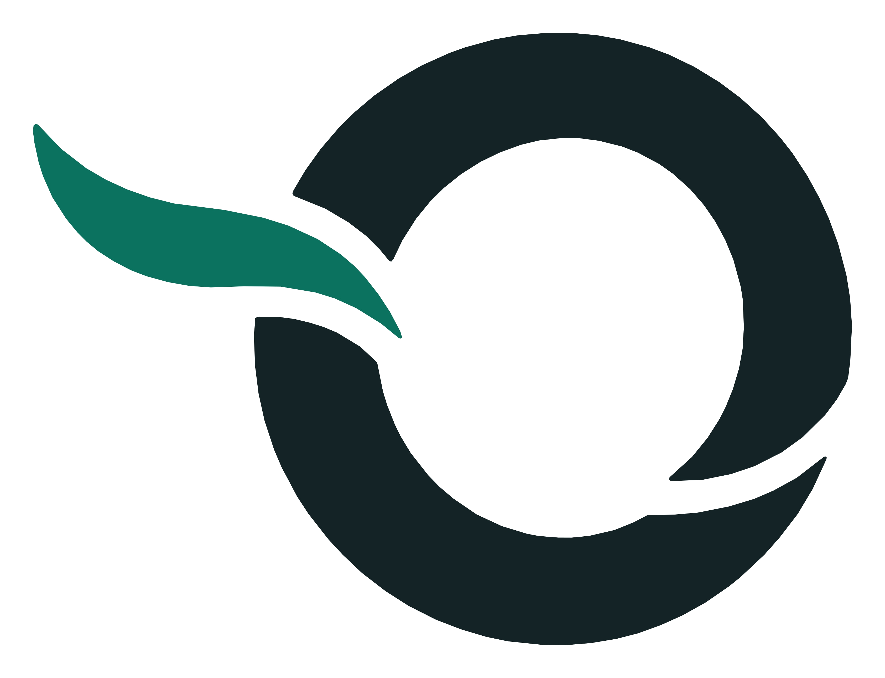
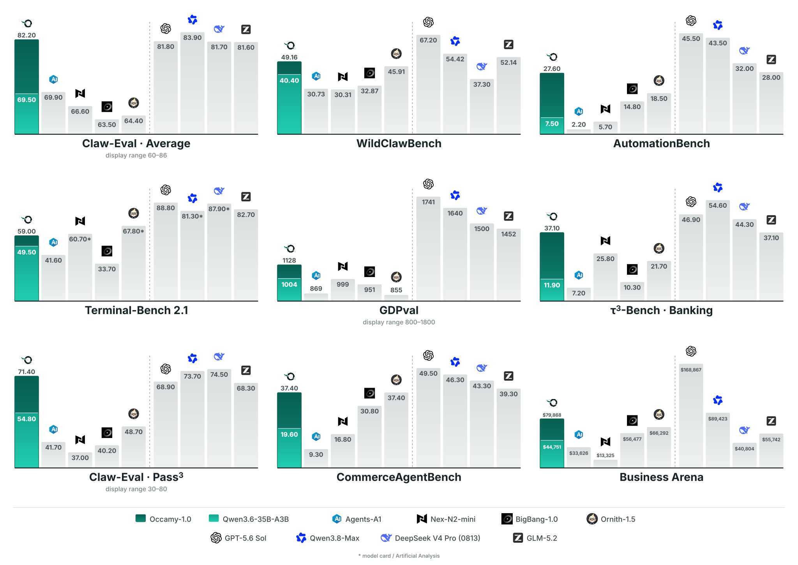

<div align="center">
  <picture>
    
  </picture>
  &nbsp;&nbsp;&nbsp;&nbsp;
  <picture>
    
  </picture>
  <h1>Occamy-1.0</h1>
  <p><strong>Open Pareto-frontier 35B Intelligence for Co-work</strong></p>
</div>

<hr>

<div align="center" style="line-height: 1;">
  <a href="https://accio-lab.github.io/occamy/"></a>
  <a href="https://huggingface.co/Accio-Lab/Occamy-1.0"></a>
  <a href="https://accio-lab.github.io/occamy/report/occamy1.0.pdf"></a>
  <a href="https://github.com/Accio-Lab/Dressage"></a>
  <a href="LICENSE"></a>
</div>

## 1. Model Introduction

Occamy-1.0 is a compact agentic model purpose-built for real-world co-work: long-horizon, stateful tasks that require coordinated use of search, code, tools, files, structured APIs, and productivity software. Starting from the post-trained [Qwen3.6-35B-A3B](https://huggingface.co/Qwen/Qwen3.6-35B-A3B) checkpoint, Occamy concentrates further training on reliable execution, persistent state tracking, recovery, and follow-through rather than relearning general capabilities from scratch.

### Key Features

- **Co-work specialization:** Designed for sustained execution across multi-step professional workflows, not isolated question answering.
- **Compact inference footprint:** A 35B-total, 3B-active Mixture-of-Experts model that keeps long-running agent workloads practical.
- **Long-horizon continuity:** Designed to keep work coherent across tool calls, delegated runs, and history rewrites such as context compaction.
- **Broad agentic capability:** Co-work gains are accompanied by strong tool calling, terminal coding, and instruction following.
- **Execution-grounded training:** Supervised fine-tuning spans general agentic work, long-horizon interaction, software engineering, and tool-call grounding.
- **Open training stack:** The multi-harness reinforcement-learning infrastructure used to train Occamy is released as [Dressage](https://github.com/Accio-Lab/Dressage).

> [!NOTE]
> Occamy is optimized for common co-work workloads, not as a replacement for frontier models on every task. Retrieval-heavy and simulated-user tasks still have headroom, and native browser or desktop visual interaction is not part of the current co-work training interface.

## 2. Model Summary

<div align="center">
<table>
<tbody>
<tr><td align="center"><strong>Architecture</strong></td><td align="center">Mixture-of-Experts causal model with vision encoder</td></tr>
<tr><td align="center"><strong>Total Parameters</strong></td><td align="center">35B</td></tr>
<tr><td align="center"><strong>Activated Parameters</strong></td><td align="center">3B</td></tr>
<tr><td align="center"><strong>Number of Layers</strong></td><td align="center">40</td></tr>
<tr><td align="center"><strong>Number of Experts</strong></td><td align="center">256</td></tr>
<tr><td align="center"><strong>Activated Experts</strong></td><td align="center">8 routed + 1 shared</td></tr>
<tr><td align="center"><strong>Base Architecture Context</strong></td><td align="center">262,144 tokens</td></tr>
<tr><td align="center"><strong>SFT Sequence Length</strong></td><td align="center">131,072 tokens</td></tr>
<tr><td align="center"><strong>Starting Checkpoint</strong></td><td align="center"><a href="https://huggingface.co/Qwen/Qwen3.6-35B-A3B">Qwen3.6-35B-A3B</a></td></tr>
<tr><td align="center"><strong>Post-training</strong></td><td align="center">Full-parameter SFT, HDPO, model merging, and SAO</td></tr>
</tbody>
</table>
</div>

Architecture fields follow the starting checkpoint's published model card. Occamy post-trains the language backbone without changing the architecture; the vision encoder and projector are frozen during SFT. The released checkpoint configuration remains the source of truth for serving limits.

## 3. Evaluation Results

<div align="center">
  <picture>
    
  </picture>
</div>

| Benchmark | Occamy-1.0 | Qwen3.6<br>35B-A3B | Agents-A1 | Nex-N2-mini | BigBang-1.0 | Ornith-1.5 |
| --- | ---: | ---: | ---: | ---: | ---: | ---: |
| Claw-Eval (average) | **82.2** | 69.5 | 69.9 | 66.6 | 63.5 | 64.4 |
| Claw-Eval (Pass³) | **71.4** | 54.8 | 41.7 | 37.0 | 40.2 | 48.7 |
| WildClawBench | **49.16** | 40.4 | 30.73 | 30.31 | 32.87 | 45.91 |
| CommerceAgentBench | **37.40** | 19.6 | 9.3 | 16.8 | 30.8 | **37.40** |
| Business Arena | **$79,868** | $44,751 | $33,626 | $13,325 | $56,477 | $66,292 |
| GDPval | **1,128** | 1,004 | 869 | 999 | 951 | 855 |
| OfficeQA Pro | 48.1 | 39.1 | 23.3 | 46.6 | 43.6 | **59.4** |
| τ³-Bench (Banking) | **37.1** | 11.9 | 7.2 | 25.8 | 10.3 | 21.7 |
| AutomationBench (Pass¹) | **27.6** | 7.5 | 2.2 | 5.7 | 14.8 | 18.5 |
| AutomationBench (partial) | **69.1** | 39.4 | 14.7 | 27.9 | 47.4 | 58.0 |
| BFCL v4 | 65.40 | 63.19 | 57.23 | 62.81 | 57.86 | **68.51** |
| VitaBench | 41.75 | 34.25 | 37.00 | 26.25 | **46.00** | 40.25 |
| Terminal-Bench 2.1 | 59.0 | 49.5 | 41.6 | 60.7<sup>*</sup> | 33.7 | **67.8<sup>*</sup>** |
| IFEval | 91.53 | 86.90 | **91.60** | **91.60** | 90.50 | 81.80 |

**Bold:** Best result in each row; ties are both bolded. <sup>*</sup> Official model-card result.

## 4. Training Recipe

Occamy uses staged specialization and consolidation:

```text
Qwen3.6-35B-A3B
  ├─ Marathon Expert: SFT → HDPO ┐
  └─ Sprint Expert: SFT          ├─ Uniform merge → SAO → Occamy-1.0
```

The Marathon Expert learns sustained execution and accuracy-conditioned efficiency, while the Sprint Expert preserves broader agentic capability. A uniform parameter-space merge combines both experts into one checkpoint with no inference-time routing or ensembling, and a final Single-Rollout Asynchronous Optimization (SAO) stage refines the merged policy on a broad co-work mixture.

The deduplicated SFT union across both experts is:

| Data source | Trajectories | Average length | Tokens |
| --- | ---: | ---: | ---: |
| General agentic | 5,418 | 37.7K | 204.1M |
| Long-horizon interactive agents | 923 | 95.8K | 88.4M |
| Terminal and software engineering | 1,228 | 35.1K | 43.1M |
| Tool-call grounding | 7,429 | 9.1K | 67.7M |
| **Overall** | **14,998** | **26.9K** | **403.3M** |

Training tasks are grounded in executable environments with observable state transitions and task-level grading. The open-source [Dressage](https://github.com/Accio-Lab/Dressage) stack provides multi-harness execution, token-exact trajectory capture, sandbox integration, and multi-segment conversion for reinforcement learning.

## 5. Deployment

Occamy-1.0 keeps the Qwen3.6-35B-A3B architecture, so the [upstream deployment recipe](https://huggingface.co/Qwen/Qwen3.6-35B-A3B#deployment) is the reference serving path. The examples below mirror that recipe with eight-way tensor parallelism and its full context length; adjust both to fit your hardware and confirm them against the released Occamy checkpoint configuration.

### SGLang

The upstream model card recommends [SGLang](https://github.com/sgl-project/sglang) 0.5.10 or newer for the Qwen3.6 architecture.

```bash
python -m sglang.launch_server \
  --model-path Accio-Lab/Occamy-1.0 \
  --port 8000 \
  --tp-size 8 \
  --mem-fraction-static 0.8 \
  --context-length 262144 \
  --reasoning-parser qwen3 \
  --tool-call-parser qwen3_coder
```

### vLLM

The upstream model card recommends [vLLM](https://github.com/vllm-project/vllm) 0.19.0 or newer for the Qwen3.6 architecture.

```bash
vllm serve Accio-Lab/Occamy-1.0 \
  --port 8000 \
  --tensor-parallel-size 8 \
  --max-model-len 262144 \
  --reasoning-parser qwen3 \
  --enable-auto-tool-choice \
  --tool-call-parser qwen3_coder
```

Both commands expose an OpenAI-compatible endpoint at `http://localhost:8000/v1`.

## 6. Model Usage

```python
from openai import OpenAI

client = OpenAI(base_url="http://localhost:8000/v1", api_key="EMPTY")

response = client.chat.completions.create(
    model="Accio-Lab/Occamy-1.0",
    messages=[
        {
            "role": "user",
            "content": "Inspect this repository, fix the failing test, and explain the change.",
        }
    ],
    max_tokens=32768,
    temperature=1.0,
    top_p=0.95,
    presence_penalty=1.5,
    extra_body={
        "top_k": 20,
        "chat_template_kwargs": {
            "enable_thinking": True,
            "preserve_thinking": True,
        },
    },
)

print(response.choices[0].message.content)
```

For multi-turn agent runs, retain the complete assistant message returned by the server, including reasoning content and tool calls, then append tool results using the standard OpenAI chat-completions schema. This preserves the execution context that Occamy relies on across long workflows.

### Agent Frameworks

Occamy was trained and evaluated across multiple harnesses, including [OpenClaw](https://github.com/openclaw/openclaw), [Hermes Agent](https://github.com/NousResearch/hermes-agent), and Accio Work. It can be integrated with other tool-using agent frameworks through the same OpenAI-compatible API.

---

## 7. License

This repository is released under the [Apache License 2.0](LICENSE). See the Hugging Face model card for the terms that apply to the model weights.

---

## 8. Contact and Correspondence

For research inquiries, model questions, or collaboration opportunities, please contact the corresponding authors:

- [Junbo Li](mailto:junboolee@gmail.com)
- [Hongwei Xue](mailto:xuehongwe@gmail.com)

For bug reports or feature requests, please open an [issue](https://github.com/Accio-Lab/occamy/issues).
